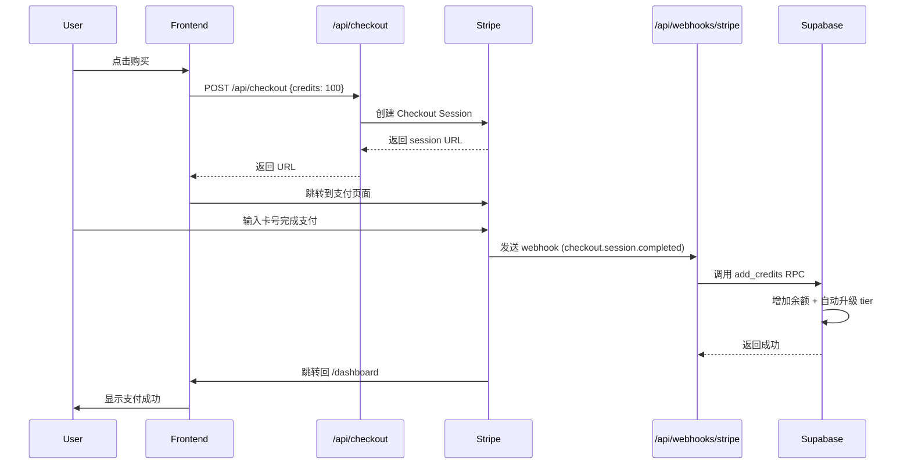

# Stripe 集成概览

> ReelVan 支付系统设计文档

---

## 🎯 产品定位

### 商业模式

```
流量包模式 (Pay-as-you-go)
├── 用户购买 Credits (虚拟货币)
├── 1 credit = $0.01
├── Credits 用于支付视频处理费用
└── 无订阅,无月费,永久有效
```

### 与订阅模式对比

| 特性     | ReelVan (流量包)  | 传统 SaaS (订阅)           |
| -------- | ----------------- | -------------------------- |
| 付费方式 | 一次性购买        | 按月/年订阅                |
| 费用     | 用多少付多少      | 固定月费                   |
| 有效期   | 永久              | 需续费                     |
| 功能差异 | 无 (所有人相同)   | 有 (Starter/Pro/Business)  |
| 用量限制 | 速率限制 (防滥用) | 套餐限制 (如 10 videos/月) |
| 适用场景 | 使用量不固定      | 稳定月度使用               |

---

## 💰 定价策略

### Credit 套餐

```typescript
const PRICING_TIERS = [
  { credits: 100, price: 100, discount: 0 }, // $1.00
  { credits: 500, price: 450, discount: 10 }, // $4.50 (省 10%)
  { credits: 2000, price: 1600, discount: 20 }, // $16.00 (省 20%) ⭐
  { credits: 10000, price: 7000, discount: 30 }, // $70.00 (省 30%)
]
```

**设计理念:**

1. **阶梯折扣** - 多买多省,激励大额购买
2. **明确差距** - 100 → 2000 → 10000 (10x/5x 倍数)
3. **心理价格** - $1 试用, $16 主流, $70 商业用户
4. **灵活扩展** - 代码支持任意数量 (100-100,000)

### 成本计算

```
API 成本: $0.10 / 5 秒视频
用户价格: API 成本 × 4 (400% 利润率)

示例 (30 秒视频):
- API 成本: 6 segments × $0.10 = $0.60
- 用户价格: $0.60 × 4 = $2.40 = 240 credits
- 利润: $2.40 - $0.60 = $1.80 (300% 利润)
```

---

## 👥 Tier 系统

### Tier 定义

| Tier   | 速率限制       | 升级条件                      | 是否永久 |
| ------ | -------------- | ----------------------------- | -------- |
| `free` | 3 videos/day   | 注册赠送 100 credits          | ✅       |
| `paid` | 50 videos/day  | 首次购买任意金额              | ✅       |
| `pro`  | 200 videos/day | 累计购买 ≥ $50 (5000 credits) | ✅       |

### 关键特性

1. **非订阅制** - Tier 是永久状态,不会降级
2. **自动升级** - 购买后 `add_credits` RPC 自动判定
3. **纯速率限制** - 只影响每日处理数量,不影响功能
4. **统一技术限制** - 所有用户视频时长 (120s)、文件大小 (500MB) 相同

### 为什么需要 Tier?

```
防滥用场景:
❌ 无限制: 用户注册 100 个账号,每天免费处理 100 个视频
✅ 有 Tier: free 用户每天只能处理 3 个,滥用成本高

商业价值:
- free (3/day): 足够试用,不够滥用
- paid (50/day): 付费用户合理配额
- pro (200/day): 大客户 VIP 体验
```

---

## 🏗️ 技术架构

### 支付流程



### 核心文件

```
app/
├── api/
│   ├── checkout/route.ts          # 创建 Stripe Checkout Session
│   └── webhooks/
│       └── stripe/route.ts        # 处理 Stripe 事件

lib/
└── video/
    └── cost.ts                    # 价格计算 + Tier 逻辑

supabase/
└── migrations/
    ├── 20251008000000_*.sql       # 数据库表 + RPC 函数
    └── 20251009022856_*.sql       # Tier 自动升级逻辑
```

### 关键函数

#### 1. `add_credits` (PostgreSQL RPC)

```sql
-- 功能:
-- 1. 增加用户 credits
-- 2. 记录交易日志
-- 3. 自动升级 tier

CREATE OR REPLACE FUNCTION add_credits(
  p_user_id UUID,
  p_amount INTEGER,
  p_stripe_payment_id TEXT,
  p_stripe_session_id TEXT
)
RETURNS BOOLEAN
```

**Tier 升级逻辑:**

```sql
-- 排除注册赠送的 100 credits,只看购买金额
IF v_new_total_earned >= 5100 THEN  -- $51+
  v_new_tier := 'pro';
ELSIF v_new_total_earned > 100 THEN  -- 任意购买
  v_new_tier := 'paid';
ELSE
  v_new_tier := 'free';
END IF;
```

#### 2. `POST /api/checkout` (Next.js API)

```typescript
// 功能:
// 1. 验证用户身份
// 2. 计算价格 (支持折扣)
// 3. 创建 Stripe Checkout Session
// 4. 返回支付 URL

// 动态定价 (无需预创建 Stripe Products)
const session = await stripe.checkout.sessions.create({
  line_items: [
    {
      price_data: {
        currency: 'usd',
        product_data: { name: '100 ReelVan Credits' },
        unit_amount: 100, // $1.00 in cents
      },
      quantity: 1,
    },
  ],
  metadata: {
    userId: user.id,
    credits: '100',
  },
})
```

#### 3. `POST /api/webhooks/stripe` (Webhook Handler)

```typescript
// 功能:
// 1. 验证 webhook 签名 (防伪造)
// 2. 处理支付事件
// 3. 调用 add_credits RPC
// 4. 发送确认邮件 (TODO)

// 安全验证
const event = stripe.webhooks.constructEvent(
  body,
  signature,
  process.env.STRIPE_WEBHOOK_SECRET!
)

// 处理事件
switch (event.type) {
  case 'checkout.session.completed':
    await supabase.rpc('add_credits', {...})
}
```

---

## 🔒 安全设计

### 1. Webhook 签名验证

```typescript
// ❌ 错误: 直接信任来自网络的请求
app.post('/webhooks/stripe', async (req) => {
  const { userId, credits } = req.body
  await addCredits(userId, credits) // 任何人都能伪造!
})

// ✅ 正确: 验证 Stripe 签名
const event = stripe.webhooks.constructEvent(body, req.headers['stripe-signature'], WEBHOOK_SECRET)
// 只有 Stripe 能生成有效签名
```

### 2. 环境变量隔离

```bash
# 测试环境
STRIPE_SECRET_KEY=sk_test_...
STRIPE_WEBHOOK_SECRET=whsec_test_...

# 生产环境 (Vercel 环境变量)
STRIPE_SECRET_KEY=sk_live_...
STRIPE_WEBHOOK_SECRET=whsec_live_...
```

### 3. RLS (Row Level Security)

```sql
-- 用户只能查看自己的交易记录
CREATE POLICY "Users can view their own transactions"
  ON credit_transactions FOR SELECT
  USING (auth.uid() = user_id);

-- 只有 service_role 能插入交易 (通过 RPC)
CREATE POLICY "Service role can insert transactions"
  ON credit_transactions FOR INSERT
  WITH CHECK (auth.role() = 'service_role');
```

---

## 📊 数据模型

### ER 图

```
users (Supabase Auth)
  ├─ 1:1 → user_credits
  └─ 1:N → credit_transactions

user_credits
  ├── user_id (PK, FK → users.id)
  ├── balance (当前余额)
  ├── total_earned (累计获得,用于 tier 判定)
  ├── total_spent (累计消费)
  └── tier (free/paid/pro)

credit_transactions
  ├── id (PK)
  ├── user_id (FK → users.id)
  ├── type (purchase/processing_debit/refund)
  ├── amount (正数充值,负数消费)
  ├── stripe_payment_id (关联 Stripe Payment)
  └── created_at
```

### 示例数据

**user_credits:**

| user_id | balance | total_earned | total_spent | tier |
| ------- | ------- | ------------ | ----------- | ---- |
| abc123  | 1850    | 2000         | 150         | paid |

**credit_transactions:**

| type             | amount | balance_after | stripe_payment_id | description            |
| ---------------- | ------ | ------------- | ----------------- | ---------------------- |
| signup_bonus     | 100    | 100           | -                 | Welcome bonus          |
| purchase         | 2000   | 2100          | pi_xxx            | Purchased 2000 credits |
| processing_debit | -250   | 1850          | -                 | Processed video abc    |

---

## 🧪 测试策略

### 本地测试 (Test Mode)

```bash
# 1. 启动 Stripe CLI
stripe listen --forward-to localhost:3000/api/webhooks/stripe

# 2. 测试卡号
Card: 4242 4242 4242 4242
Expiry: 12/25
CVC: 123

# 3. 验证 webhook 日志
--> checkout.session.completed [evt_test_...]
<--  [200] POST http://localhost:3000/api/webhooks/stripe
```

### 生产测试 (Live Mode)

```bash
# 1. 小额真实支付测试
# 购买 100 credits ($1.00)

# 2. 检查 Stripe Dashboard
# Payments → 查看支付记录
# Webhooks → 查看事件日志

# 3. 验证数据库
SELECT * FROM credit_transactions WHERE stripe_payment_id = 'pi_xxx';
```

---

## 📈 监控指标

### 业务指标

- **转化率:** 访问 → 注册 → 首次购买
- **ARPU (Average Revenue Per User):** 平均每用户收入
- **Tier 分布:** free/paid/pro 用户占比
- **复购率:** 购买 2+ 次的用户比例

### 技术指标

- **Webhook 成功率:** >99%
- **支付成功率:** >95%
- **平均响应时间:** <2 秒

### 监控工具

- **Stripe Dashboard:** 支付、退款、争议
- **Vercel Logs:** API 错误、性能
- **Supabase Logs:** 数据库操作

---

## 🚀 未来扩展

### 短期 (1-3 个月)

- [ ] 添加优惠券系统 (Stripe Promotion Codes)
- [ ] 邮件通知 (支付成功、余额不足)
- [ ] 发票生成 (Stripe Invoices)

### 中期 (3-6 个月)

- [ ] 推荐奖励 (推荐人得 credits)
- [ ] 企业批量采购 (定制价格)
- [ ] 多货币支持 (USD, EUR, HKD)

### 长期 (6-12 个月)

- [ ] 订阅模式 (可选,与流量包并存)
- [ ] API 接入 (开发者 credits)
- [ ] 白标方案 (企业客户自有品牌)

---

## 📚 相关文档

- [STRIPE_QUICKSTART.md](./STRIPE_QUICKSTART.md) - 5 分钟快速开始
- [STRIPE_SETUP.md](./STRIPE_SETUP.md) - 完整配置指南
- [STRIPE_CHECKLIST.md](./STRIPE_CHECKLIST.md) - 部署检查清单
- [Stripe 官方文档](https://stripe.com/docs)

---

**版本:** 1.0.0
**最后更新:** 2025-10-09
**维护者:** ReelVan Dev Team
