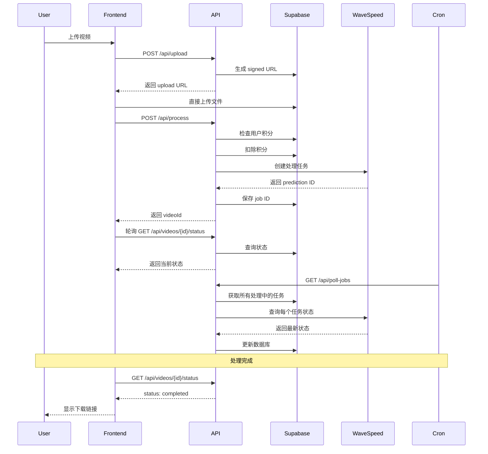

# WaveSpeed API Integration Guide

本文档说明如何配置和使用 WaveSpeed API 进行视频水印去除。

## 📋 目录

1. [配置](#配置)
2. [API 端点](#api-端点)
3. [工作流程](#工作流程)
4. [定时任务设置](#定时任务设置)
5. [成本追踪](#成本追踪)

---

## 配置

### 1. 环境变量

在 `.env.local` 中添加以下配置：

```bash
# WaveSpeed API Key
WAVESPEED_API_KEY=your_api_key_here

# 每 5 秒视频的成本（美元）
VIDEO_API_COST_PER_5_SECONDS=0.10

# Cron 任务密钥（用于保护轮询端点）
CRON_SECRET=your_random_secret_string
```

### 2. 获取 API Key

1. 注册 WaveSpeed 账号: https://wavespeed.ai
2. 前往 API 设置页面
3. 创建新的 API Key
4. 复制到 `.env.local`

---

## API 端点

### WaveSpeed API 响应格式

**重要：** WaveSpeed API 所有响应都使用以下信封格式：

```json
{
  "code": 200,
  "message": "success",
  "data": {
    // 实际数据在这里
  }
}
```

### 1. 提交视频处理

**POST /api/process**

提交视频进行水印去除处理。

**Request Body:**

```json
{
  "filename": "video.mp4",
  "fileSize": 10485760,
  "duration": 30.5,
  "mimeType": "video/mp4",
  "storagePath": "user-id/timestamp-video.mp4",
  "removeWatermark": true,
  "enhanceQuality": false,
  "targetResolution": null,
  "targetAspectRatio": null
}
```

**Response:**

```json
{
  "success": true,
  "data": {
    "videoId": "uuid",
    "status": "processing",
    "estimatedTime": 61,
    "creditsDeducted": 610
  }
}
```

### 2. 查询视频状态

**GET /api/videos/{videoId}/status**

查询视频处理状态。

**Response:**

```json
{
  "success": true,
  "data": {
    "id": "uuid",
    "status": "completed",
    "progress": 100,
    "filename": "video.mp4",
    "processedUrl": "https://...",
    "errorMessage": null,
    "createdAt": "2025-10-08T...",
    "startedAt": "2025-10-08T...",
    "completedAt": "2025-10-08T...",
    "creditsUsed": 610
  }
}
```

**Status 值:**

- `pending` - 等待处理
- `processing` - 正在处理
- `completed` - 处理完成
- `failed` - 处理失败

### 3. 轮询处理任务 (Cron Job)

**GET /api/poll-jobs**

定期检查所有处理中的视频状态。

**Headers:**

```
Authorization: Bearer {CRON_SECRET}
```

**Response:**

```json
{
  "success": true,
  "data": {
    "message": "Polling completed",
    "totalJobs": 5,
    "results": {
      "completed": 3,
      "failed": 1,
      "stillProcessing": 1,
      "errors": 0
    }
  }
}
```

### 4. Webhook 处理器

**POST /api/webhooks/wavespeed**

接收 WaveSpeed 的状态更新通知（如果支持）。

---

## 工作流程

### 完整处理流程



### 状态转换

```
pending → processing → completed
                    ↘ failed
```

---

## 定时任务设置

### 方案 1：Vercel Cron Jobs（推荐）

在 `vercel.json` 中配置：

```json
{
  "crons": [
    {
      "path": "/api/poll-jobs",
      "schedule": "*/5 * * * *"
    }
  ]
}
```

这将每 5 分钟自动调用一次轮询端点。

**配置步骤：**

1. 在项目根目录创建 `vercel.json`
2. 添加上述配置
3. 部署到 Vercel
4. 前往 Vercel Dashboard → Settings → Environment Variables
5. 添加 `CRON_SECRET` 环境变量

### 方案 2：外部 Cron 服务

使用 cron-job.org 或类似服务：

1. 注册 https://cron-job.org
2. 创建新任务
3. URL: `https://your-domain.com/api/poll-jobs`
4. Headers: `Authorization: Bearer {your_cron_secret}`
5. 间隔：每 5 分钟

### 方案 3：本地开发测试

手动触发轮询：

```bash
curl -X GET http://localhost:3000/api/poll-jobs \
  -H "Authorization: Bearer your_cron_secret"
```

---

## 成本追踪

### 计算公式

```typescript
// 每 5 秒视频成本 $0.10
const API_COST_PER_5_SECONDS = 0.1

// 计算总成本
function calculateApiCost(durationSeconds: number): number {
  return Math.ceil(durationSeconds / 5) * API_COST_PER_5_SECONDS
}

// 计算所需积分 (1 积分 = $0.01)
function calculateCreditsRequired(durationSeconds: number): number {
  const costUsd = calculateApiCost(durationSeconds)
  return Math.ceil(costUsd * 100)
}
```

### 示例

| 视频时长 | API 成本 | 所需积分 |
| -------- | -------- | -------- |
| 5 秒     | $0.10    | 10       |
| 10 秒    | $0.20    | 20       |
| 30 秒    | $0.60    | 60       |
| 60 秒    | $1.20    | 120      |
| 120 秒   | $2.40    | 240      |

### 成本监控

所有 API 调用都会被记录在数据库中：

```sql
-- 查询总成本
SELECT
  SUM(api_cost_usd) as total_api_cost,
  COUNT(*) as total_videos
FROM videos
WHERE status = 'completed';

-- 按用户统计
SELECT
  user_id,
  COUNT(*) as videos_processed,
  SUM(estimated_cost_credits) as credits_spent,
  SUM(api_cost_usd) as api_cost
FROM videos
GROUP BY user_id
ORDER BY credits_spent DESC;
```

---

## 错误处理

### 常见错误

#### 1. WaveSpeed API 错误

```json
{
  "success": false,
  "error": "WaveSpeed API error (401): Unauthorized"
}
```

**解决方案：** 检查 `WAVESPEED_API_KEY` 是否正确。

#### 2. 积分不足

```json
{
  "success": false,
  "error": "Insufficient credits. Required: 120, Available: 50"
}
```

**解决方案：** 用户需要购买更多积分。

#### 3. 视频太长

```json
{
  "success": false,
  "error": "Video duration exceeds maximum allowed (120 seconds)"
}
```

**解决方案：** 视频需要裁剪到 2 分钟以内。

### 自动退款

如果处理失败，系统会自动退还积分：

```typescript
// 在 app/api/poll-jobs/route.ts 中
if (prediction.status === 'failed') {
  await supabase.rpc('refund_credits', {
    p_user_id: video.user_id,
    p_video_id: video.id,
    p_amount: video.estimated_cost_credits,
  })
}
```

---

## 监控和日志

### 关键日志点

1. **视频提交：**

   ```
   ✅ Video submitted to WaveSpeed: { videoId, predictionId, status }
   ```

2. **轮询结果：**

   ```
   📊 Polling 5 processing jobs...
   🔄 Job {jobId} status: processing
   ✅ Video {videoId} completed: {url}
   ❌ Video {videoId} failed
   ```

3. **Webhook 接收：**
   ```
   📨 Received WaveSpeed webhook: { id, status }
   ```

### 性能监控

推荐使用 Vercel Analytics 或 Sentry 监控：

- API 响应时间
- 错误率
- 处理成功率
- 平均处理时长

---

## 最佳实践

1. **成本控制**
   - 实施严格的视频时长限制（最长 2 分钟）
   - 在前端显示预估成本
   - 定期审查 API 开销

2. **用户体验**
   - 实时显示处理进度
   - 处理完成后发送邮件通知
   - 提供清晰的错误信息

3. **安全性**
   - 保护 CRON_SECRET
   - 验证所有用户输入
   - 使用 RLS 保护数据库

4. **可靠性**
   - 设置合理的轮询间隔（推荐 5 分钟）
   - 实施重试机制
   - 记录所有错误日志

---

## 故障排查

### 问题：视频一直显示 "processing"

**检查步骤：**

1. 确认 Cron 任务正在运行
2. 检查 WaveSpeed API 状态
3. 查看数据库中的 `external_job_id`
4. 手动调用 `/api/poll-jobs` 测试

### 问题：成本计算不正确

**检查步骤：**

1. 验证 `VIDEO_API_COST_PER_5_SECONDS` 环境变量
2. 检查视频时长是否正确记录
3. 查看 `credit_transactions` 表确认扣款

### 问题：轮询端点返回 401

**解决方案：**
确保请求头包含正确的 `Authorization: Bearer {CRON_SECRET}`

---

## 相关文件

- **WaveSpeed 客户端：** `lib/video-api/wavespeed.ts`
- **处理 API：** `app/api/process/route.ts`
- **轮询端点：** `app/api/poll-jobs/route.ts`
- **状态查询：** `app/api/videos/[videoId]/status/route.ts`
- **Webhook：** `app/api/webhooks/wavespeed/route.ts`
- **成本计算：** `lib/video/cost.ts`

---

## 下一步

1. [ ] 配置 Vercel Cron Jobs
2. [ ] 设置成本监控告警
3. [ ] 实现邮件通知
4. [ ] 添加处理进度百分比
5. [ ] 实现视频下载功能
